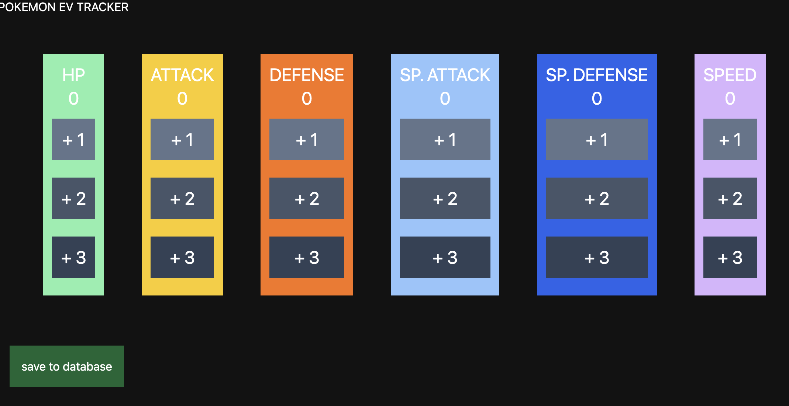

## Planning
After my previous brainstorming sesh (find that [here](/posts/pokemon-rom-0)), I immediately started thinking of my tech stack. 

I wanted to use this project to learn new technologies. So, instead of my usual full stack TypeScript tech stack, here's what I opted for:
- Svelte/SvelteKit + Tailwind for frontend UI
- Golang for backend
- PostgreSQL for database

I haven't really thought of how I'm going to deploy all of this - I might just Dockerize everything and deploy the container to a cloud service.

Anyways, with my tech stack in place, I got to work.

## Database setup
First thing on my list was to learn how to spin up a local PostgreSQL database. I installed it via homebrew and used this command to start it up:

```sh
homebrew services start postgresql
```

I then read up on some DB fundamentals. Mainly, this included things like creating databases and tables, and inserting/modifying rows in tables.

After that, I moved on to design my DB schema. I created a `pokemons` table that would keep track of the EV training progress for each pokemon. I had a column for each stat (HP, attack, defense, special attack, special defense, and speed), a column for the pokemon name, and a primary key. 

I added a separate PK since training multiple instances of the same pokemon for different team comps is common, which means that the pokemon name won't necessarily be a unique identifier.

```sql
CREATE TABLE pokemons (
	id			uuid default gen_random_uuid(),
	name		varchar(50),
	hp			int,
	attack		int,
	defense 	int,
	sp_attack 	int,
	sp_defense	int,
	speed		int,
	PRIMARY KEY (id)
);
```

## Backend
I left the DB there for now and moved on to the backend. I whipped up a Golang module to serve as the API layer that takes requests from the frontend, interacts with the DB, and sends responses back to the frontend. 

I'm aware of frameworks like [Gin](https://github.com/gin-gonic/gin), but by whipping up my own HTTP server with the standard library, I can get comfortable with the language quickly. Eventually, as my app grows, I will most likely migrate my code over to a proper web framework.

I started off by creating a module dedicated to logging into the database. This is achieved with the function below: 

```go
func loginDB() *sql.DB {
	err := godotenv.Load()
	if err != nil {
		log.Fatal("Error loading DB credentials")
	}

	dbUser := os.Getenv("DB_USER")
	dbName := os.Getenv("DB_NAME")

	dataSource := fmt.Sprintf("user=%s dbname=%s sslmode=disable", dbUser, dbName)

	ret, err := sql.Open("postgres", dataSource)
	if err != nil {
		log.Fatal("Error loggin into DB ", err)
	}

	return ret
}
```

I stored my database credentials in a `.env` file so I don't include them in version control. I read these in as environment variables and open up a connection to the Postgres server from earlier. The return value is then exported to other packages.

```go
var Db *sql.DB = loginDB()
```

Previously I designed this package so that a new DB connection was opened per HTTP request. The number of concurrent connections quickly reached the limit allowed by Postgres and crashed the server.

To fix this, I exported 1 connection from the DB module and use that, such that 1 server instance opens at most 1 database connection (I don't know if this is best practices - I'm going to read up on this more as I migrate over to a proper web framework).

The DB module was complete, so I moved onto create a simple GET endpoint.

```go
func FetchPokemonHandler(w http.ResponseWriter, r *http.Request) {
	if r.Method != "GET" {
		w.Write([]byte(`{"message":"ERROR: invalid request"}`))
		return
	}

	addHeaders(w)

	dao := db.Db
	pokemonName := r.URL.Query().Get("pokemon")

	res, err := dao.Query("SELECT * FROM pokemons where name = $1", pokemonName)
	if err != nil {
		// ... error handling truncated for brevity ...
	}
	defer res.Close()
	
	var pokemons []Pokemon
	for res.Next() {
		var p Pokemon
		err = res.Scan(&p.Id, &p.Name, &p.Hp, &p.Atk, &p.Def, &p.Spa, &p.Spd, &p.Spe)
		if err != nil {
			break
		}
		pokemons = append(pokemons, p)
	}

	json.NewEncoder(w).Encode(pokemons)
}
```

This handler function will read the name of the requested pokemon, look it up in the database with `dao.Query()`, and return the EV progress to the client. 

This is also where I realized that web frameworks do so much heavy lifting for developers. When I used Express, I didn't have to think about handling the contents of the HTTP method header. I didn't have to manually configure response headers to specify that `Content-Type` is `application/json`.

I looked at some example code for Gin, and it seems like my handlers could be condensed down to a couple lines... I can't wait to port this stuff over to Gin 😃

Anyways, in `src.go`, I register the handlers to HTTP URLs, and start accepting connections on port `8080`. Backend complete (for now)!

```go
func main() {
	http.HandleFunc("/get-pokemon", handlers.FetchPokemonHandler)
	http.ListenAndServe(":8080", nil)
}
```

## Frontend

I didn't do that much for frontend. I whipped up a very basic UI to allow users to increment their EVs for any stat by 1/2/3 (the only possible base values in pokemon games). It looks scuffed but it gets the job done!! 



The "save to database" button is mocked for now, since I don't have an endpoint to accept incoming EV changes.

## Other considerations
As I worked through my project today, I thought of a couple more features:

First, pokemon can equip EV-boosting items to increase the amount of EV they receive per battle. Once I reach a state in-game where these items are accessible, I'll inevitably use them, which means it would be nice to reflect that in my app as well.

There are also consumable items that modify EVs in different increments. I think I will try to add an option to support these items as well.

Finally, a pain point I found is that it's annoying to manually look up the EV yield for every pokemon I defeat. For example, to train my Sneasel (which evolves into Weavile), I defeated a variety of pokemon - [Starly](https://bulbapedia.bulbagarden.net/wiki/Starly_(Pok%C3%A9mon)), [Pikachu](https://bulbapedia.bulbagarden.net/wiki/Pikachu_(Pok%C3%A9mon)), [Floatzel](https://bulbapedia.bulbagarden.net/wiki/Floatzel_(Pok%C3%A9mon)), [Electabuzz](https://bulbapedia.bulbagarden.net/wiki/Electabuzz_(Pok%C3%A9mon)), [Bibarel](https://bulbapedia.bulbagarden.net/wiki/Bibarel_(Pok%C3%A9mon)), and more. Because of my +1/2/3 interface, I still had to go through the process of looking up how many EV points are yielded by each pokemon I defeated. Instead, it would be nice to look up pokemon on my website directly, and that would update my EV distributions accordingly.
