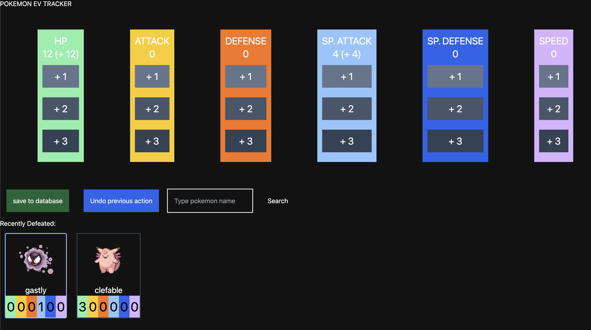

## Persisting to DB
Continuing from where I left off [yesterday](/posts/pokemon-rom-1), I wrote an endpoint to persist EV changes in my database. 

```go
func UpdatePokemonHandler(w http.ResponseWriter, r *http.Request) {
	if r.Method != "POST" {
		w.Write([]byte(`{"message":"ERROR: invalid request:"}`))
		return
	}

	addHeaders(w)

	dao := db.Db
	var body PokemonUpdateRequest

	jsonDecoder := json.NewDecoder(r.Body)
	err := jsonDecoder.Decode(&body)
	if err != nil {
		log.Fatal("CANT READ REQ BODY", err)
	}

	// update pokemon in DB
	// really long SQL statement; omitted for brevity
	_, err = dao.Exec(
		queryString, body.NewHp, body.NewAtk, body.NewDef,
		body.NewSpa, body.NewSpd, body.NewSpe, body.Name,
	)

	if err != nil {
		log.Fatal("FAILED TO UPDATE DB ", err)
	}

	w.Write([]byte(`{"message":"Success"}`))
}
```

This function is attached to a POST endpoint that expects a JSON payload consisting of the new EV progress to save. Nothing too crazy here - I read and parse the request payload, then execute a SQL statement to push the new changes to the database. 

```go
type PokemonUpdateRequest struct {
	Name	string
	NewHp	uint
	NewAtk	uint
	NewDef	uint
	NewSpa	uint
	NewSpd	uint
	NewSpe	uint
}
```

This is the struct used to represent the request payload: the sturcture is identical to the table schema in my database.

## Submitting changes (frontend)
The frontend changes were straightforward too.

First, I added an "undo" button, which will roll back the latest EV changes in case the user misclicks/double clicks the wrong EV. Keep in mind that these changes aren't actually submitted to the server until the user clicks that submit button - so this is just a QoL feature. Every EV increment is recorded in a stack data structure (ie. JS arrays with `pop()` and `push()` methods), making this super easy to implement. 

More importantly, I added a search bar to look up pokemons, calculate their EV yield, and increment this automatically. This change makes EV training with wild pokemon much, much less annoying!



Based on user input, I make calls to [PokeAPI](https://pokeapi.co/) to figure out the EV yield of pokemons. Results are then cached on the client's browser via LocalStorage so that I'm not spraying PokeAPI with redundant requests.

Finally, I implemented the callback to send properly formatted POST requests to the backend to save the EV changes. 

```ts
async function saveToDB() {
	const stats = [hpStat, atkStat, defStat, spaStat, spdStat, speStat];

	const res = await fetch("http://localhost:8080/update-pokemon", {
		method: "POST",
		body: JSON.stringify({
			Name: "sneasel",
			NewHp: hpStat.getPoints(),
			NewAtk: atkStat.getPoints(),
			NewDef: defStat.getPoints(),
			NewSpa: spaStat.getPoints(),
			NewSpd: spdStat.getPoints(),
			NewSpe: speStat.getPoints(),
		})
	});

	for (const stat of stats) {
		stat.resetAfterSave();
	}

	recentlyDefeated = [];
	recentlyDefeatedSet.clear();
	localStorage.removeItem("recentlyDefeated");
}
```

The variables dealing with recently defeated pokemon are reset, and cache entries are purged as well. The decision to purge my cache was because I thought my workflow would be to EV train, and save my changes to the database once I'm about to call it a day. I might revert this later.

## Pain points
First, I want to mention some of the annoying parts of my developer experience so far. My workflow so far looked something like:
- start up `postgresql` locally
- start up client app locally
- start up backend locally
- start developing

It would be really nice to group the first 3 steps into 1. So, I'm thinking of dockerizing this spin-up process to aid in development.

## Major issue
I noticed this as I was trying the app out myself. EV training can get a little mind-numbing, so I started dozing off while playin the game on autopilot lol. After a couple of minutes, I was second-guessing myself as to whether I forgot to increment my EVs correctly.

This demonstrates a fundamental flaw with the design of my application: **it's possible for the database to be inaccurate**, if not updated correctly. For example, while mindlessly EV training, you forget to increment the attack EV for a Machop you defeated. Now you have 1 extra EV point that goes towards nowhere (see [this](https://dgkimm.com/posts/pokemon-rom-0#:~:text=Keeping%20an%20accurate%20record%20of%20these%20EV%20points%20is%20extremely%20important%2C%20since%20every%204%20EV%20points%20to%20a%20stat%20will%20contribute%20to%20%2B1%20in%20that%20stat.) for an explanation) - WASTED!

The whole point of my application was to keep an *accurate* record of my EVs and display them to the user. So if accuracy isn't guaranteed, what's the point? Am I in shambles??? 🥺🥺🥺

## Pivoting
I didn't see a point in continuing this project if I couldnt't find a way to guarantee the accuracy of my application. So, I spent the rest of the day thinking and researching better ways to go about this. After a while, I came up with an idea:

> *What if I read the game files directly to figure out the EVs?*

I'm not sure why I didn't think of this to begin with. Ultimately, the games store this EV information but just decides to hide it. If I can learn the way these game files are structured, I can extract 100% accurate information about the pokemons' EVs! We are so back!!!

So that's what I'm going to focus on for now - learning about the game file structure, and developing a service to parse them to gain EV distribution info.