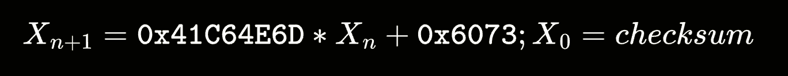

## ROM file research
First thing on my agenda today was figuring out the way *Pokemon Platinum* save files are structured. After a little digging, I came across this [Project Pokemon forum](https://projectpokemon.org/home/docs/gen-4/) with almost ALL of the information I needed (shoutout to whoever curated that forum, you're my savior)! 

You can find the source code [here](https://github.com/dingdongg/pkmn-platinum-rom-parser). If you want to see the code snippets I talk about in this blog, feel free to browse through my commit history.

## Savefile structure
Savefile data is stored in 2 pairs of blocks. Each pair consists of a "small" and "big" block. One pair serves as a backup (ie. a copy of the previous savefile). In *Pokemon Platinum*, the small block spans from `0x0` to `0x0C0FF`, and the big block from `0x0C100` to `0x1E2DF`. The second pair of blocks are offset by `0x40000` from the first pair addresses.

The layout of the small block has been documented on the internet. It stores information on the player/trainer's in-game name, their ID, amount of money at the time of save, gender, number of badges, items in the player's bag, etc. More importantly, the small block holds information on the pokemon in the player's party. This is the block I'll be parsing first.

The contents of the big block aren't really discussed, but from what I gathered it houses information on pokemon stored in the player's PC boxes. I think I'll extend my EV tracker to look at pokemon stored in PC boxes later on.

The last few bytes in each block (big and small) are used as a footer, which allows the game to link together the small and big blocks of each pair and determine which block pair is the current savefile vs. backup.

## Generation IV text encoding
*Pokemon Platinum* is a game released during "Generation IV". Generations just describe a collection of pokemon games released during a time period. The other gen 4 games are *HeartGold* and *SoulSilver*, which are re-makes of the original *Gold* and *Silver* games for the GBA.

Instead of using existing encoding like UTF- or ASCII, generation 4 pokemon games had their own text encoding mechanism. Each possible character corresponds to a 2-byte word in memory. For example, `D` is represented as `0x012E` in memory. 

Based on my research, I found that player names are stored at offset `0x68` in the savefiles, up to a maximum of 8 characters (= 16 bytes). These were the 16 bytes stored in my savefile:

```
2E 01 39 01 38 01 31 01 31 01 43 01 3F 01 FF FF
 D     O     N     G     G     Y     U     \0
```

The alternating bytes `0x01` start with the second byte indicated to me that the savefiles used little endian. Then, `2E 01` is just `0x012E` (`D`), `39 01` is `0x0139` (`O`), and so on until `FF FF` which I assumed indicates a null-terminating character. 

In order to decode any arbitrary string, I created a text parser package.

```go
func Char(index uint16) (string, error) {
	file, err := os.ReadFile("char_encoder/table.json")
	if err != nil {
		log.Fatal("Error parsing char table file: ", err)
	}
	
	var chars []string
	err = json.Unmarshal(file, &chars)
	if err != nil {
		log.Fatal("oops ?? ", err)
	}

	if index == END_OF_STRING || index == NULL_CHAR {
		// end of string
		return "", errors.New("invalid index")
	}
	
	return chars[index], nil
}
```

`table.json` is just an array of characters that I parsed from Bulbapedia's [character encoding article](https://bulbapedia.bulbagarden.net/wiki/Character_encoding_(Generation_IV)). I whipped up a simple JavaScript program to parse the contents of the `<table>` element holding this information.

```js
// const htmlString = "HTML string omitted b/c it's too long";

const { document } = new JSDOM(htmlString).window;
const table = document.getElementById("tabletable");
const body = table.children[0];
const rows = body.children;

const results = [];

for (let i = 1; i < rows.length; i++) {
    const cells = rows[i].children;
    for (let j = 1; j < cells.length; j++) {
        const cell = cells[j];
        results.push(cell.textContent.split("\n")[0]);
    }
}

fs.writeFile("table.json", JSON.stringify(results, null, 4));
```

## Pokemon data structure
At this point I was ready to move onto parsing the actual pokemon data. Information on party pokemon starts at offset `0xA0` from the start of a small block, each pokemon 236 bytes long.

The first few bytes are unencrypted metadata about the pokemon. It includes the pokemon's personality value, which is a 4 byte unsigned integer that determines things like gender, ability, nature, and other properties of that pokemon. 

This part also contains a checksum, which serves as the key used to encrypt + decrypt pokemon data in savefiles.

## Symmetric encryption
To my surprise, the encryption mechanism used is pretty straightforward. One crucial component of encryption is the use of a pseudorandom number generator (PRNG). This generator outputs a sequence of numbers whose properties are similar to truly random number sequences.

The PRNG used consists a linear congruential generator, which is a recursive formula that computes pseudorandom numbers based on its previous results. This is the formula used for our case:



The key (checksum) is used to seed the PRNG (ie. set its base case), and every subsequent output (the upper 16 bits, to be specific) of this equation is XORed with every 2-byte word in the appropriate address range. For the first party pokemon, these are bytes from offset `0x08` to `0x87`.

```go
type PRNG struct {
	Checksum uint16
	Personality uint32
	PrevResult uint
}

func (prng *PRNG) Next() uint16 {
	result := 0x041C64E6D * prng.PrevResult + 0x06073
	prng.PrevResult = result
	result >>= 16
	return uint16(result & 0xFFFF) 
}
```

And this is the function used to carry out decryption:

```go
func DecryptPokemons(prng prng.PRNG, ciphertext []byte) {
	plaintext_buf := ciphertext[:8]

	// 1. XOR to get plaintext words
	for i := 0x8; i < 0x87; i += 0x2 {
		word := binary.LittleEndian.Uint16(ciphertext[i:i + 2])
		plaintext := word ^ prng.Next()
		littleByte := byte(plaintext & 0x00FF)
		bigByte := byte((plaintext >> 8) & 0x00FF)
		plaintext_buf = append(plaintext_buf, littleByte, bigByte)
	}

	// ... get different bits of info at different offsets
}
```

After decryption, you get the plaintext pokemon data. However, this information is separated into 4 32-byte blocks. Furthermore, these blocks are shuffled around based on the pokemon's personality value! In order to determine the permutation of the 4 blocks, this formula is used to calculate the shift value:

```go
((p & 0x3E000) >> 0xD) % 24 // p is the personality value
```

There are 25 possible shift values, and their mappings to shuffle orders are documented [here](https://projectpokemon.org/home/docs/gen-4/pkm-structure-r65/). Once I calculate the shift value, I also know the order of the 4 blocks. At this point it's just offset calculations to get the values that I want!

Using this program, I can now read in my actual savefile and determine the exact EV values for my pokemon. Remember the Sneasel I mentioned in a previous post? Well, I finished its EV training using the old web interface I made. I tried to go for 252 attack EVs, 6 special defense EVs, and 252 speed EVs. Using my new program, these were the actual EV distrutions:

```
Pokemon: 'WEAVILE'
Stats:
        - HP:  0
        - ATK: 255
        - DEF: 0
        - SpA: 0
        - SpD: 3
        - SPE: 252
Total EV Spenditure: 510 / 510
```

It turns out I over-invested 3 EVs into my attack stat, which should've gone towards my special defense stat 🥲 time to re-train this one.

## Next steps
I expected this ROM parsing to take a lot longer than a day, but this is totally cool too. Here's a high-level overview of my next couple of steps:
- integrate core EV feature back into my web app 
- figure out if i still need a database component in my app (since I can just save directly to file)
- extend to other NDS games (HGSS, BW, B2W2)
- create dedicated functions to fetch different properties of party pokemon, including:
	- EV
	- items held
	- level
	- name
	- current stats
