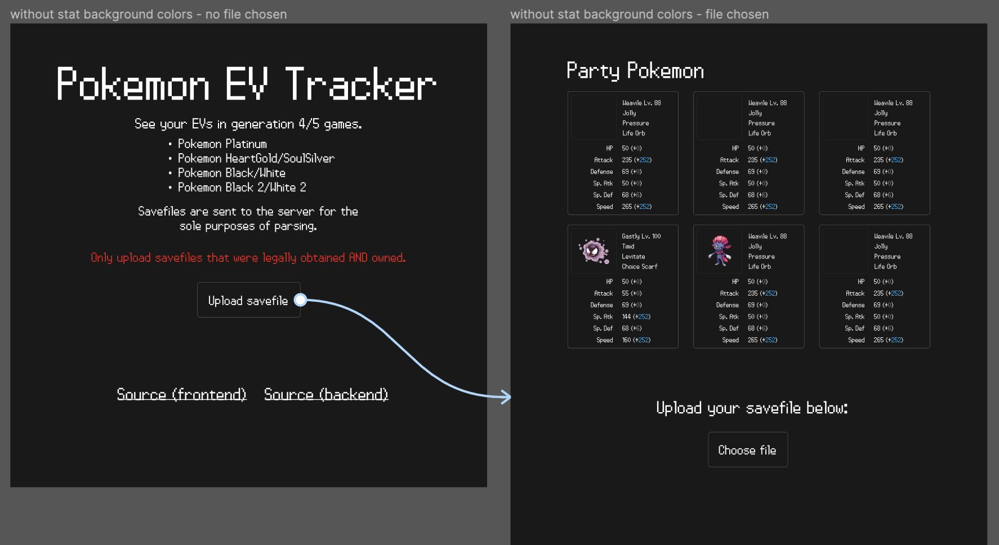
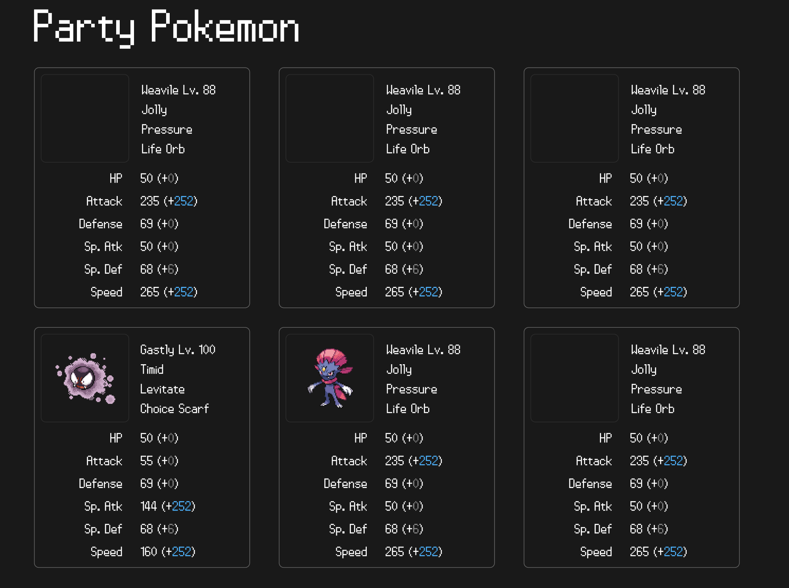
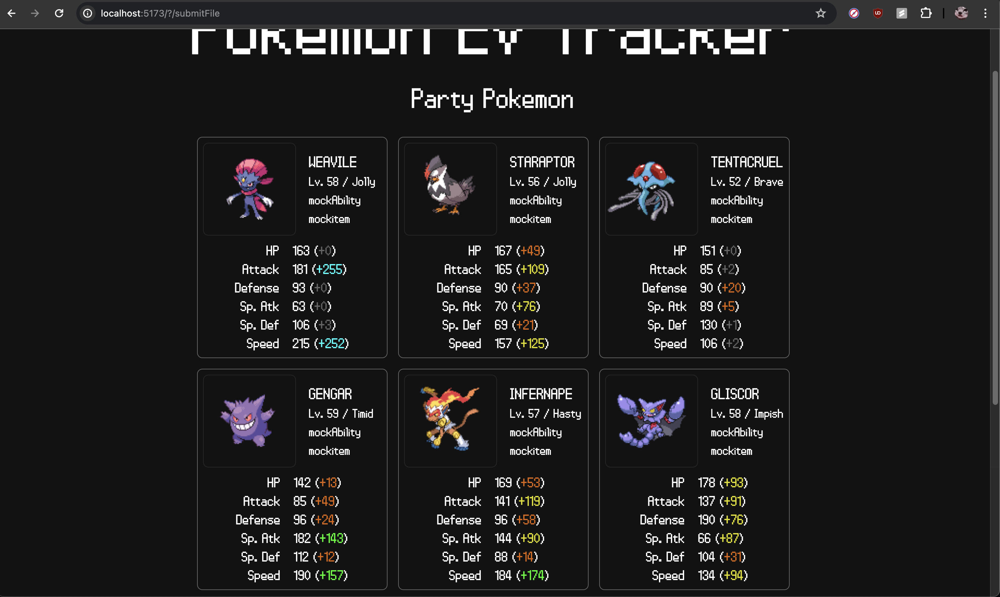

I'm back! I missed a couple days but I swear I wasn't slacking 😤😤😤 

Over the past few days, I've been working on pivoting my project to guarantee the accuracy of EV data. Here's a quick summary of what I did:
- Modularized my ROM parser repository to be imported as a dependency in my backend API
- Updated the ROM parser API so that it's more intuitive
- Further process the data from the ROM parser in the API layer, and return to the client
- Designed Figma mockups for the new frontend UI
- Re-vamp frontend to read new responses from the server

## ROM Parser - API changes
So far, my ROM parser was simply printing the buffer contents to stdout. I went ahead and designed new structs that would be used to actually return the data back to the client:

```go
type EffortValues struct {
	Hp        uint
	Attack    uint
	Defense   uint
	SpAttack  uint
	SpDefense uint
	Speed     uint
}

type BattleStat struct {
	Level 	uint
	Stats	EffortValues
}

type Pokemon struct {
	PokedexId uint16
	Name  string
	BattleStat
	HeldItemId uint16
	Nature	string
	AbilityId uint
	EVs		EffortValues
}
```

First, I included a couple of new fields. I decided to include the pokemon's pokedex ID, its level, held item, nature, ability, and base stats (in addition to EVs), all of which will be rendered on the frontend. I was able to determine the nature by calculating `personality % 25`, and mapping the result to one of the natures outlined in [this table](https://bulbapedia.bulbagarden.net/wiki/Personality_value#Nature).

*Aside: When I was trying to catch a sneasel to train, I was getting so annoyed because it took me literal hours before I found the right nature. Now that I know my chances of encountering one with the nature I want (Jolly) is essentially ~4%, the math checks out. I am at peace now 🙏*

The information in `BattleStat` structs are in a separate struct, because this data is stored in a separate "battle stats" block that has been encrypted slightly differently. The same LCG algorithm is used, but the generator must be seeded with the personality value rather than the checksum. In addition, decryption starts at offset `0x88` instead of `0x8`.

## ROM Parser module
Next, I published my ROM parser as a [public Golang module](https://pkg.go.dev/github.com/dingdongg/pkmn-platinum-rom-parser). There is no stable release yet, since I want to thoroughly check for correctness via unit tests before the major v1.0.0 release. This part was pretty challenging, but the [Golang docs](https://go.dev/doc/modules/managing-dependencies) on managing dependencies helped a lot. 

First, I learned that in order to "publish" a go module, you have to push the code online via a public URL. Since I pushed my stuff to my GitHub repo, this part was done for me already.

After that, I had to assign a version tag to my code. I started off with `v0.1.0` and have since published 4 more iterations (`latest=v0.1.4`). This is because I made more changes with each iteration. Golang docs recommend that with each iteration of new changes, you should publish a new version rather than modifying a previously tagged version. I believe this is to preserve backwards compatibility (especially with public API changes), but also to make sure that the dependency security checks don't throw false alarms.

Finally, I updated the Golang module mirror to recognize the new tagged version of my ROM parser library. This allows the `go get` command to find my newly updated library.

```sh
GOPROXY=proxy.golang.org go list -m github.com/dingdongg/pkmn-platinum-rom-parser@v0.1.4
```

After that, when I ran `go get github.com/dingdongg/pkmn-platinum-rom-parser`, I could access my ROM parser code in my backend API. This all sounds pretty trivial, but there's something cool about fetching a library that you developed & uploaded to the internet!

## Backend changes
Here, I mostly followed the changes to the public API changes in my ROM parser. I upgraded my DTO structs to include all of the information being returned from my ROM parser. I also added a `spriteUrl`, which is a public URL to the pokemon's 2D sprite that I format using the pokedex ID.

```go
type StatResponse struct {
	Hp 			uint	`json:"hp"`
	Atk			uint	`json:"atk"`
	Def 		uint	`json:"def"`
	Spa			uint	`json:"spa"`
	Spd			uint	`json:"spd"`
	Spe			uint	`json:"spe"`
}

type PokemonResponse struct {
	Id			string	`json:"id"`
	SpriteUrl	string	`json:"spriteUrl"`
	Level 		uint 	`json:"level"`
	Name		string	`json:"name"`
	Ability 	string 	`json:"ability"`
	HeldItem 	string	`json:"heldItem"`
	Nature		string	`json:"nature"`
	EffortValues StatResponse	`json:"effortValues"`
	BaseStats	 StatResponse	`json:"baseStats"`
}
```

Then, I designed a separate endpoint `POST /post-savefile` that reads the uploaded file from the frontend, parses it, and returns the results.

```go
func ReadSaveFileHandler(w http.ResponseWriter, r *http.Request) {
	// ... request validation ...

	r.ParseMultipartForm(1 << 19)
	var buf bytes.Buffer

	file, header, err := r.FormFile("savefile")
	if err != nil {
		fmt.Println("BRUH ", err)
		return
	}
	defer file.Close()
	
	fmt.Printf("filename: %s\n", header.Filename)
	io.Copy(&buf, file)

	results := ROMparser.Parse(buf.Bytes())
	var res []PokemonResponse
	
	// ... parse response and return it ...
}
```

For POST requests with file uploads, the client is expected to send the data with `multipart/form-data` encoding. `r.ParseMultipartForm(maxMem)` will parse the request with this encoding in mind. It will transfer up to `maxMem` bytes of the request into memory, and the rest is stored in temporary files on disk. I set the limit to `1 << 19` (=524288) bytes, which is the size of one savefile.

The reason I didn't use the default memory threshold (~32 MB) is because I didn't want to open up my backend to requests that send in huge files, which could potentially cause memory overflow. I haven't implemented savefile validations yet so this is the least I can do in terms of beefing up security.

Anyways, `r.FormFile("savefile")` returns the file contents into a variable called `file`. `file` has type `multipart.File`, which is an interface that implements the `io.Reader` methods, allowing us to read the contents of its underlying buffer.

I then copy the file contents into a new buffer, and call `ROMparser.Parse()` with the buffer as input.

## Figma mockups
Now that all of my backend changes were complete, I started thinking about how to best present this information on the frontend. I created a new Figma project to do this, and after a few iterations this was my final mockup:



The page on the left would be my landing page. Once the user selects and submits their savefile, it would render a page with information about their party pokemon (the page on the right). On this page, users also have the option to upload different files to view.

The page on the right displays detailed information about each pokemon in party. Most importantly, it highlights the pokemons' EVs in parentheses in the stats section.



Since this app's main purpose is to track EVs, I wanted the EVs to be one of the first things to catch the users' eyes. The use of colors helped me achieve that! In this screenshot, your eyes were (hopefully) drawn to the blue EV values as opposed to the ones colored in grey. Through this, users can focus on the stats that have accumulated relatively more EVs.

## Frontend changes
All that was left to do was to implement the Figma mockup. It sounded simple at first, but this was single-handedly the hardest part. I got humbled hard and gained so much respect for frontend devs 😮‍💨

The biggest hurdle was uploading the selected file to my backend. I utilized SvelteKit's form actions for this. I designed a `submitFile` action in `+page.server.js` that forwards the form data to my backend API:

```js
export const actions = {
    submitFile: async ({ fetch, request }) => {
        const formData = await request.formData();

        const res = await fetch("http://localhost:8080/post-savefile", {
            method: "POST",
            body: formData,
        });

        const body = await res.json();
        return { data: body };
    }
};
```

This return value is made available to my main page, which is used to render results from the backend.

The reason this part was so confusing is because I kept sending in the JS file object describing the file, rather than the file itself...

```js
	const formData = await request.formData();
	const file = formData.get("savefile"); // THE CULPRIT

	const res = await fetch("http://localhost:8080/post-savefile", {
		method: "POST",
		body: file, 
	});
```

Since SvelteKit uses server-side rendering by default, and the form action is ran server-side, client-side JavaScript is totally optional! I think this is great for keeping bundle sizes small for now. I'm not locked into this "no-JS" state, though: in the future, I can always opt into JavaScript to progressively enhance my application. 

Moving onto the markup, below is the HTML form that invokes this server action upon submission:

```html
<form action="?/submitFile" method="POST" enctype="multipart/form-data">
    <input type="file" name="savefile" id="savefile" required class="
        file:py-2 file:px-6 file:bg-transparent file:border-none
        file:mr-10 file:bg-slate-700 text-xl file:rounded-full
        file:hover:bg-slate-600
    "/>
    <button type="submit" class="mt-3 mr-[20px] py-3 px-5 border-2 text-xl rounded-full">
        submit file
    </button>
</form>
```

Since I am uploading files, I have to set the form element's `enctype` to `multipart/form-data`. This way, the backend can properly read and parse the file data being sent over.

I do some conditional rendering based on the results I get back from the form action.
```svelte
{#if form?.data}
	<h2 class="text-4xl my-10">Party Pokemon</h2>
	<div class="grid grid-rows-2 grid-cols-3 gap-4">
	{#each form.data as p}
		<Pokemon pokemon={p} />
	{/each}
	</div>
{:else}
	<!-- Render parts of the landing page. Omitted for conciseness -->
{/if}
```

Here is the final result!



I added more color mappings based on the EV values. In decreasing order of EVs, the color sequence is: blue -> green -> yellow -> orange -> grey. Also, the ability/held item names are going to be mocked out until I port over a mapping from their ID to names.

## Next steps
I am writing this at 3am after writing code all day, so my brain is too fried to think of my next steps 🫠 I'll have to flesh the details out tomorrow, but at a high level I want to:
- look into deployment options
- consider adding edit EV features
- extending support for more gen 4/5 games
- other QoL features that can be baked into the website (EV yield lookups)
- features that can increase user retention? (something like weekly competitions for "who has the best team?!")