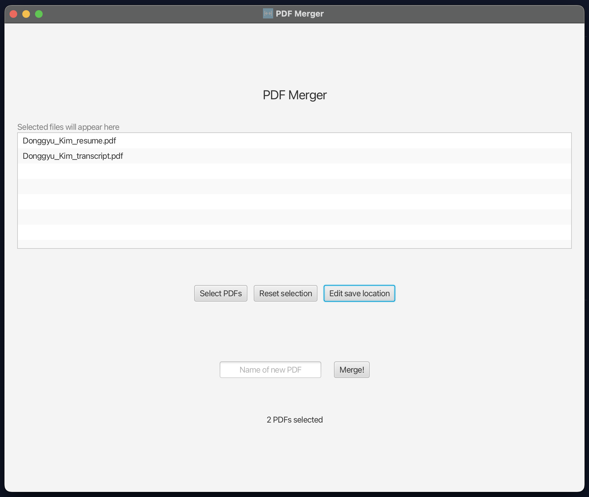
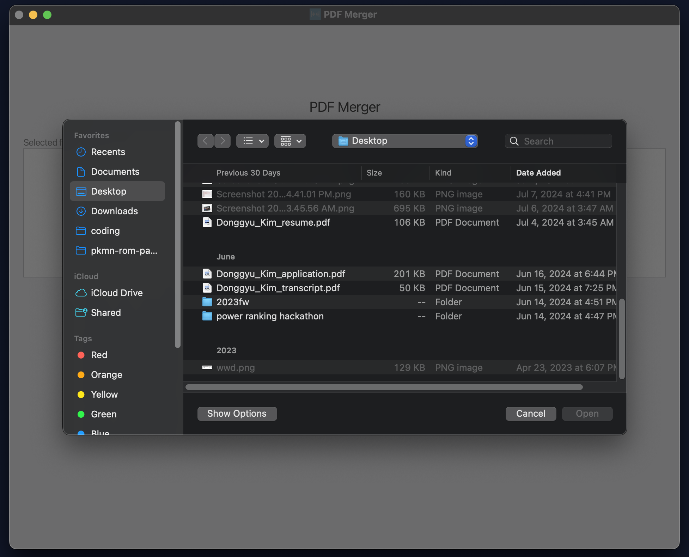

---
techStack:
- java
- javaFX
pubDate: 2022-07-01
repoUrl: https://github.com/dingdongg/pdf-merger
title: PDF Merger
layout: ../../layouts/ProjectLayout.astro
---

## Table of contents
- [description](#description)
- [file selection](#file-selection)
- [save path configuration](#save-path-configuration)
- [technologies used](#technologies-used)

## Description 

PDF Merger, unsurprisingly, merges multiple PDF files into one. 

It's an app that I developed back in 2022, when my only option to merge PDFs was to use web-based tools hosted by strangers. I was very paranoid that they might secretly save my files in a remote database somewhere 😬😬, so I decided to build my own tool.

## Features

PDF merger has one simple goal: *merging PDF files*. As part of this, it supports a couple of features:
- Selecting files to merge
- File path configuration of new PDF

## File selection

Users can select the source PDF files to merge. The GUI includes a "Select files" button that invokes the operating system's native file browser.

File selections can also be reset with the "Reset selection" button.

## Save path configuration

Users can freely choose the directory/folder to which their new PDF will be saved. Again, this will bring up the OS's file browser where the user can select a directory as the destination. There is a default path configured, so this is optional.

The user can then choose a name for the new PDF file, then click "Merge!". 

## Technologies used
This is a Java-based desktop GUI application. The entire app was written in Java, with the GUI being implemented using JavaFX.

I followed object-oriented principles in creating this app:

- ***Encapsulation***: Features like the file merger and save file selector were ***encapsulated*** into their own classes 

- ***Abstraction***: The internal logic/implementation of file merging was ***abstracted*** away from clients by utilizing private attributes/methods, which decoupled the public API from its implementation details

- ***Inheritance***: My application extended the `Application` superclass from JavaFX, saving me from having to develop my GUI entirely from scratch 😮‍💨

- ***Polymorphism***: By interacting with thrown exceptions through the `Throwable` supertype, I was able to invoke ***polymorphism*** at runtime by having each exception class implement the logging method differently

Furthermore, PDF merging was executed using Apache's PDFBox open-source library. 

*Aside: It was through this project that I realized the importance of the open-source ecosystem! Having just started out in software development, it would've taken me a very long time to implement this logic all from scratch.*
