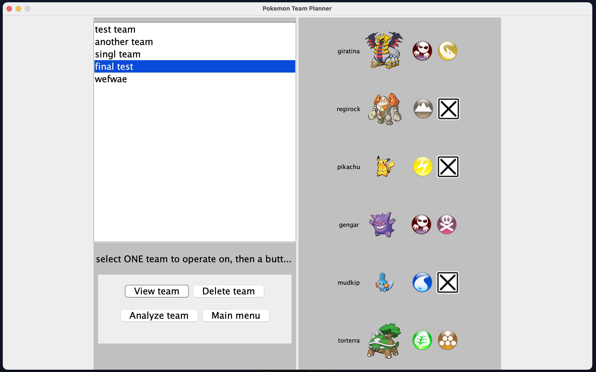
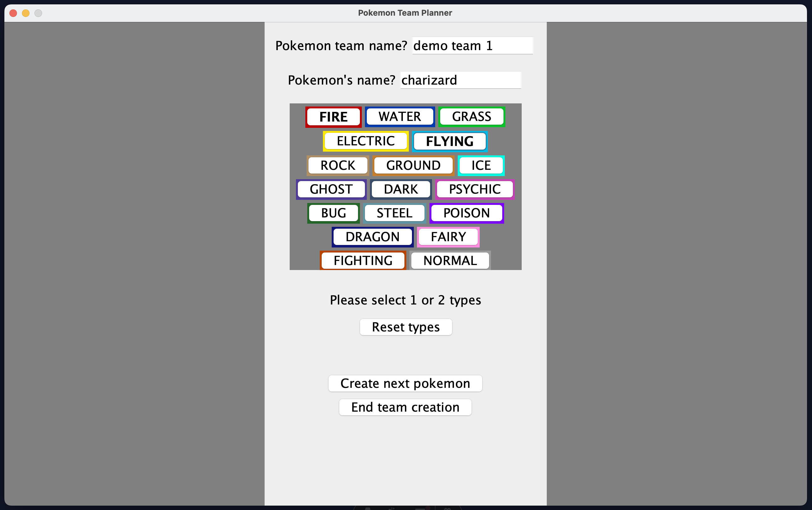
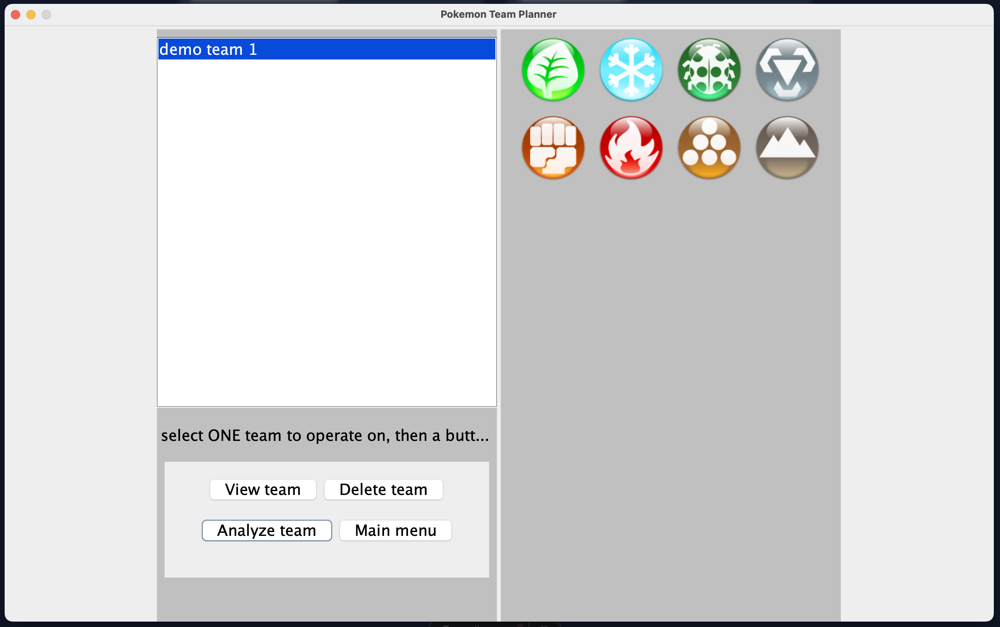
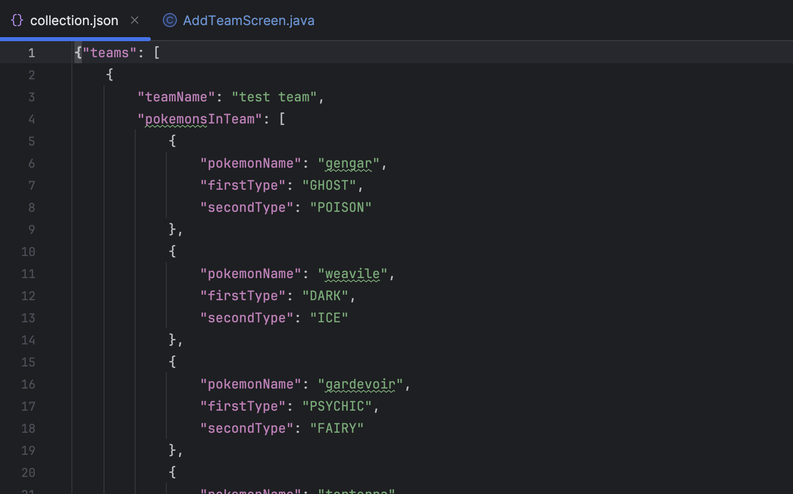

---
techStack:
- java
- java_swing
- junit
pubDate: 2021-02-01
repoUrl: https://github.com/dingdongg/pokemon-team-planner
title: Pokemon Team Draft Manager
layout: ../../layouts/ProjectLayout.astro
---

Table of contents:
- [description](#description)
- [feature #1 - team management](#team-management)
- [feature #2 - strength analysis](#team-strength-analysis)
- [feature #3 - data persistence](#data-persistence)
- [technologies used](#technologies-used)

## Description 

Pokemon Team Draft Planner is a desktop application I wrote in Java. It's an application for both casual and competitive pokemon players to whip up their pokemon dream teams :D

## Features

This app offers various features for managing pokemon teams.
- *Team management functionality (creating/viewing/deleting teams)*
- *pokemon team strength analysis*
- *persistence to non-volatile memory (aka saving/loading data)*

All of the above features can be accessed via a graphical user interface (GUI)!

## Team management

Users can create new teams using a GUI. They can set a nickname for the team, and can add up to 6 pokemons to that team.

There's also a screen to view the list of all pokemon teams the user generates (as seen [above](#description)).

## Team strength analysis

Users can also have any of their teams analyzed for its strengths. The strength analysis determines the pokemon types that the analyzed team is strong against.

## Data persistence

Users can save their team drafts to non-volatile memory, and load it back into the program in the future. This was implemented by writing JSON reader/writer classes.

## Technologies used
This is a Java-based desktop GUI application. The GUI was implemented using Java Swing, and the logic/model to represent pokemon were all implemented using Java. 

I followed object-oriented principles in creating this app:
- I represented Pokemon and other units of data by ***encapsulating*** them into classes
- I incorporated ***abstraction*** by utilizing private members/methods to hide unnecessary details from external classes
- ***Inheritance*** was used when designing finer-level exception classes, which extended the `Throwable` class
- By interacting with thrown exceptions through the `Throwable` supertype, I was able to invoke ***polymorphism*** at runtime by having each exception class implement the logging method differently

In addition, I followed test-driven development (TDD) when writing my application. By writing automated unit tests first (using JUnit), I was able to detect bugs/unforeseen edge cases earlier on in the development process, thus increasing the reliability of my application.